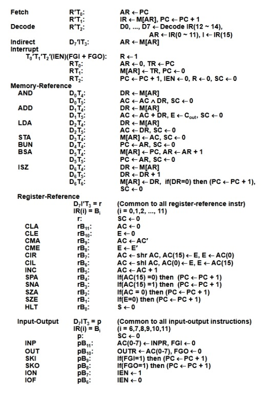
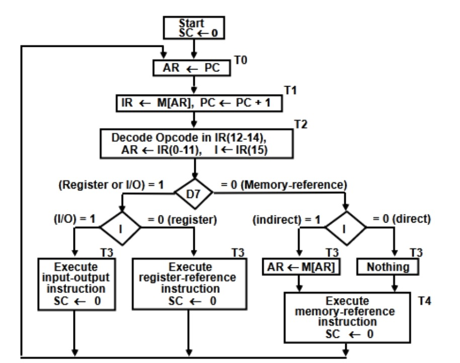
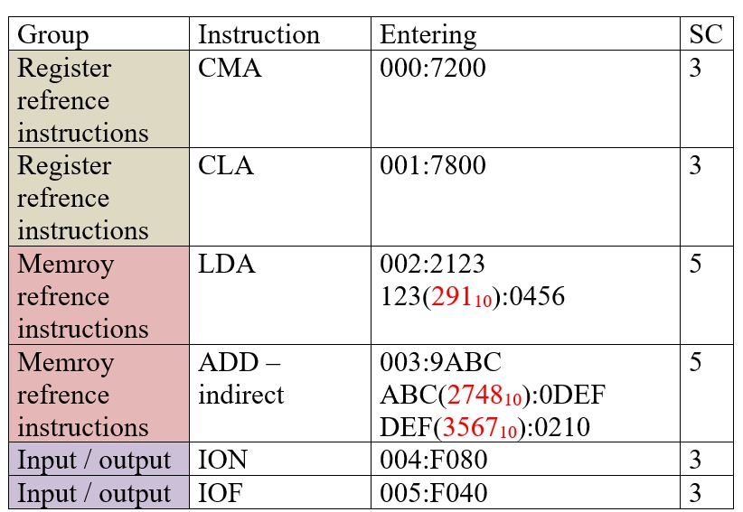
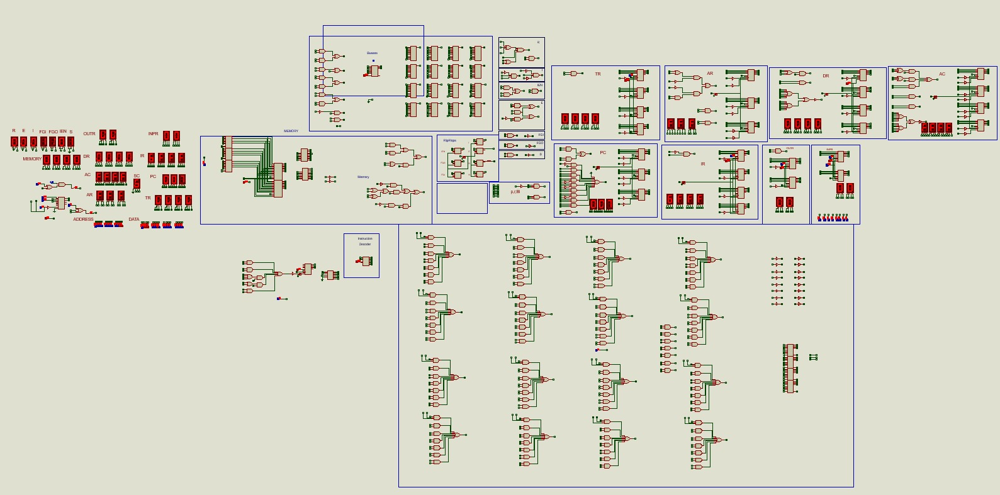
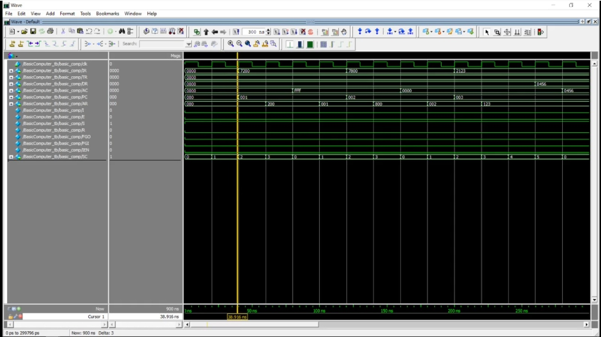

# Microprocessors II Project - Mano's Basic Computer Implementation

**Faculty of Engineering, Kafrelsheikh University**  
**Electrical Engineering Department - 2nd Year, 2nd Semester**

## Project Overview
This project implements **Mano's Basic Computer** architecture using:
- **Proteus 8** for circuit design and simulation
- **Verilog HDL** with ModelSim for digital logic verification
- 6 test instructions covering all instruction types

## Instruction Set Architecture
  
*Reference instruction set used for Verilog implementation*

## Design Methodology
1. **Flowchart & Table**  
     
   *Used as the blueprint for Verilog coding*

2. **Implemented Test Instructions**  
     
   *6 verification instructions (2 from each category):*
   - **Register Reference**: `CMA`, `CLA`
   - **Memory Reference**: `LDA`, `ADD (indirect)`
   - **I/O**: `ION`, `IOF`

## Simulation Results
### Proteus Implementation
  
*Complete circuit schematic in Proteus*

### ModelSim Verification
  
*Waveform verification of test instructions*
